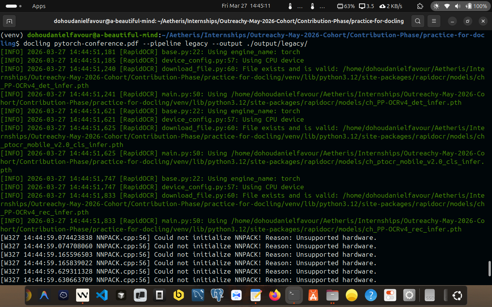
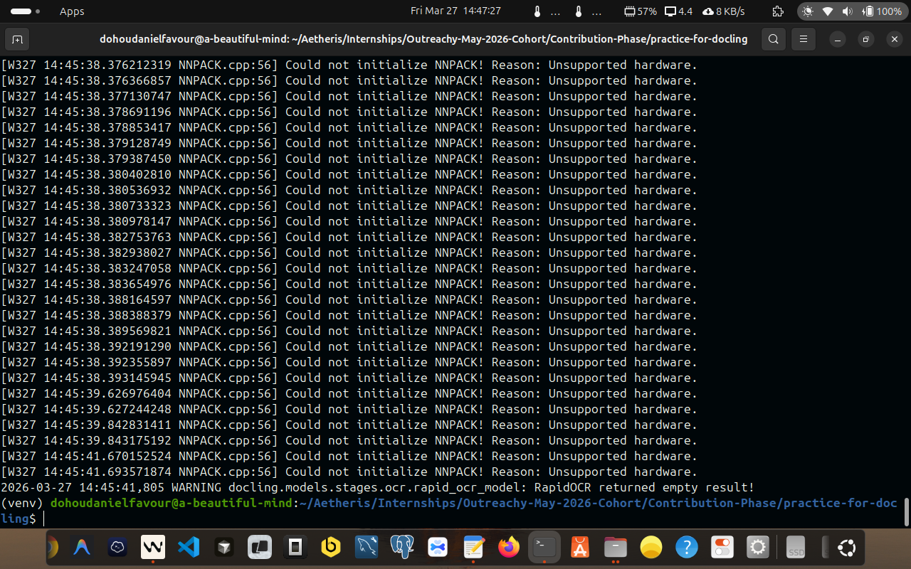
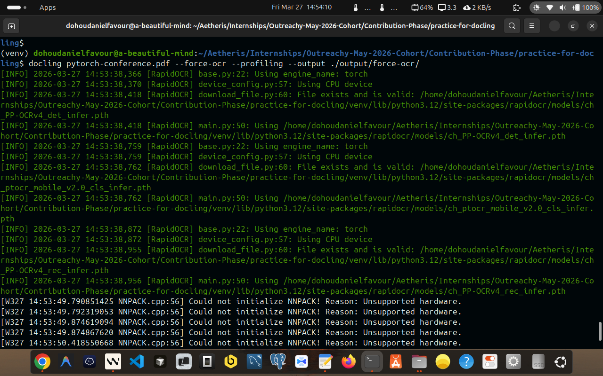
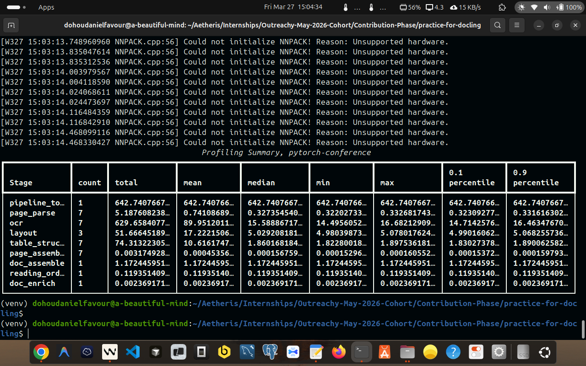

# Docling Exploration: My Outreachy 2026 Contribution

- **Issue:** [Issue #122: Docling: explore document processing basics](https://forge.fedoraproject.org/commops/interns/issues/122)
- **Author:** Dohou Daniel Favour
- **Date:** 2026-03-27
- **Task:** Docling - Document Processing Basics (Exploration)

---

## Background and Purpose

As part of my Outreachy 2026 contribution to the [Ramalama](https://github.com/containers/ramalama) project, I was asked to explore [Docling](https://www.docling.ai/) — the document processing tool that powers Ramalama's RAG (Retrieval-Augmented Generation) functionality.

Before a language model can answer questions about a PDF, something has to read it first. That something is Docling. It is not a simple text extractor — it is a document understanding system that uses machine learning models to identify layout regions, reconstruct table structure, determine reading order, and produce output optimised for downstream AI workflows.

This task gave me a hands-on understanding of Docling's CLI, its output formats, its processing options, and the trade-offs between them — all of which are directly relevant to how Ramalama's RAG pipeline behaves in practice.

---

## My Environment

| Component | Version |
|---|---|
| OS | Linux 6.14.0-37-generic (Ubuntu) x86\_64 |
| Python | CPython 3.12.3 |
| pip | 24.0 |
| docling | **2.82.0** |
| docling-core | 2.70.2 |
| docling-ibm-models | 3.12.0 |
| docling-parse | 5.6.1 |
| GPU | None (CPU-only inference) |

I ran all commands inside a Python virtual environment to keep dependencies isolated. I activated it before every session with:

```bash
source venv/bin/activate
```

---

## The Source Document I Used

- **File:** `pytorch-conference.pdf`
- **Size:** 4.7 MB
- **Content:** PyTorch Conference 2026 — Sponsorship Prospectus (Paris, France, 7–8 April 2026)

I chose this document intentionally because it is a real-world stress-test for a document processing pipeline. It has:

- **Multi-column layout** — pages use side-by-side column arrangements
- **A large sponsorship comparison table** — 7 columns, 20 rows, listing benefits across Diamond, Gold, Silver, Bronze, Startup, and Non-Profit tiers with pricing from $4,000 to $50,000
- **25 embedded images** — logos, graphics, and decorative elements
- **Mixed content** — text blocks, headings, lists, figures, and structured tables all on the same pages
- **Professional typesetting** — not a synthetic test; produced by a real layout tool

A sponsorship brochure is more challenging than a plain text document and more representative of the kinds of documents a RAG system would need to process in production.


---

## About the Warnings I Encountered

Every run produced these messages in the terminal:

```
[W327 13:54:08.913322637 NNPACK.cpp:56] Could not initialize NNPACK!
Reason: Unsupported hardware.
```

And occasionally:

```
WARNING docling.models.stages.ocr.rapid_ocr_model: RapidOCR returned empty result!
```

When I first saw these, I thought something had gone wrong. After investigating, I learned they are both harmless.

- **NNPACK warning** — NNPACK is an optional CPU acceleration library for PyTorch. My CPU does not support the required instruction sets. PyTorch automatically falls back to standard CPU operations. This warning appears on every run and has no effect on the output.

- **RapidOCR empty result** — Docling's OCR engine tried to extract text from a region — likely a decorative logo or graphic — and found nothing readable. This is expected behaviour for image regions that contain no text. The rest of the document processes normally.

---

## Step 1: Installing Docling

I started by creating a virtual environment and installing Docling inside it:

```bash
python3 -m venv venv
source venv/bin/activate
pip install docling
```


What surprised me was how large the dependency tree is. Docling pulls in PyTorch, torchvision, and several IBM Research model packages. That makes sense once you understand that Docling uses deep learning models for layout analysis and table recognition — it is not a lightweight text extractor.

I verified the installation with:

```bash
pip show docling
```

Output:

```
Name: docling
Version: 2.82.0
Summary: SDK and CLI for parsing PDF, DOCX, HTML, and more, to a unified
         document representation for powering downstream workflows such as
         gen AI applications.
Author-email: Christoph Auer <cau@zurich.ibm.com>, Michele Dolfi <dol@zurich.ibm.com>,
              Maxim Lysak <mly@zurich.ibm.com>, Nikos Livathinos <nli@zurich.ibm.com>,
              Ahmed Nassar <ahn@zurich.ibm.com>, Panos Vagenas <pva@zurich.ibm.com>,
              Peter Staar <taa@zurich.ibm.com>
Location: ./venv/lib/python3.12/site-packages
Requires: accelerate, beautifulsoup4, certifi, defusedxml, docling-core,
          docling-ibm-models, docling-parse, filetype, huggingface_hub,
          lxml, marko, openpyxl, pandas, pillow, pluggy, polyfactory,
          pydantic, pydantic-settings, pylatexenc, pypdfium2, python-docx,
          python-pptx, rapidocr, requests, rtree, scipy, torch, torchvision,
          tqdm, typer
```

---

## Step 2: Checking the Version

```bash
docling --version
```

Output:

```
Docling version: 2.82.0
Docling Core version: 2.70.2
Docling IBM Models version: 3.12.0
Docling Parse version: 5.6.1
Python: cpython-312 (3.12.3)
Platform: Linux-6.14.0-37-generic-x86_64-with-glibc2.39
```

I noticed that `--version` reports not just the top-level `docling` package but all sub-packages in the ecosystem:

- **docling** — the CLI and SDK entry point
- **docling-core** — the unified document model (`DoclingDocument`) and shared data structures
- **docling-ibm-models** — the ML models for layout analysis and table structure recognition
- **docling-parse** — the PDF parsing backend


I also explored the full help page to understand what options were available before running any experiments:


---

## Step 3: Default Conversion (Markdown)

My first real experiment was the default conversion — no extra flags, just pointing Docling at the PDF:

```bash
docling pytorch-conference.pdf
```

Since I hadn't specified `--output`, the file landed in the current directory. I then organised it:

```bash
mv pytorch-conference.md output/default/
```

On subsequent runs I used `--output` directly:

```bash
docling pytorch-conference.pdf --output ./output/default/
```

- **Output:** `output/default/pytorch-conference.md`
- **File size:** 1.2 MB
- **Line count:** 281


### Why Markdown Is the Default

I was curious why Markdown was chosen as the default output, rather than plain text or HTML. After thinking through it, it makes sense for three reasons:

1. **LLMs understand Markdown natively** — Language models trained on internet data have seen enormous amounts of Markdown. Headings, tables, and emphasis are semantically meaningful to them in a way that raw text is not.
2. **Markdown has natural chunking points** — RAG systems split documents into chunks before embedding. The heading hierarchy (`#`, `##`, `###`) gives chunkers meaningful split points that respect the document's logical structure.
3. **It is human-verifiable** — I could open the `.md` file immediately and check whether the conversion looked right. JSON or binary formats would have required additional tooling to inspect.

The first few lines of the output:

```markdown
7-8 April 2026 | Paris, France

## 2026 SPONSORSHIP PROSPECTUS


## About PyTorch Conference
```

The 25 images are embedded as base64 data URIs — those long `data:image/png;base64,...` strings. They account for almost all of the 1.2 MB file size. The actual text and table content is only about 26 KB.

---

## Step 4: HTML Output

```bash
docling pytorch-conference.pdf --to html --output ./output/html/
```


- **Output:** `output/html/pytorch-conference.html`
- **File size:** 1.2 MB

When I opened this in a browser, I got a fully rendered version of the document — headings styled correctly, the sponsorship table laid out in rows and columns, and all the images visible. The structure maps cleanly to HTML elements:

- Section headers → `<h1>`, `<h2>`, `<h3>`
- Body text → `<p>`
- Tables → `<table>` with `<tr>`, `<th>`, `<td>`
- Images → `` (embedded by default)

The file is **self-contained** — one file that renders completely in any browser with no external dependencies. That is useful for sharing or archiving, but creates a 1.2 MB file because all 25 images are still embedded as base64.

| Format | Size | Notes |
|---|---|---|
| Markdown | 1.2 MB | 25 base64 images embedded |
| HTML (embedded) | 1.2 MB | Same image data, plus HTML tags |

---

## Step 4b: HTML with Referenced Images

After learning about the `--image-export-mode` flag from `docling --help`, I tried:

```bash
docling pytorch-conference.pdf --to html --image-export-mode referenced \
  --output ./output/html-referenced-image-export-mode/
```


- **HTML file size:** 22 KB
- **PNG artifacts total:** ~900 KB (25 separate PNG files)
- **Combined total:** ~922 KB

This was one of the more interesting results. Instead of embedding images inline, Docling extracted each one as a separate PNG file into an `_artifacts/` subdirectory, and the HTML file references them with relative paths:

```html

```

The HTML file itself shrank from 1.2 MB to just **22 KB** — a roughly **55x reduction** in primary file size.

The three image export modes and what they produce:

| Mode | HTML file | Image data location | Self-contained? |
|---|---|---|---|
| `embedded` (default) | ~1.2 MB | Inside the HTML as base64 | Yes |
| `referenced` | ~22 KB | Separate PNG files in `_artifacts/` | No |
| `placeholder` | Smallest | Not exported at all | N/A |

### Why This Matters for RAG

In a RAG pipeline, I would not want to embed 25 images into a text index. The `referenced` mode gives me exactly what I need — a lean 22 KB HTML file containing just the text and structure, with the images sitting separately in case a vision model needs them. For Ramalama running on a personal laptop, loading a 22 KB file into a text pipeline is dramatically more efficient than loading 1.2 MB.

The trade-off: the HTML file is no longer portable on its own. Moving it without the PNG folder breaks all images. In a managed pipeline, that is an acceptable trade.

---

## Step 5a: JSON Output

```bash
docling pytorch-conference.pdf --to json --output ./output/json/
```


- **Output:** `output/json/pytorch-conference.json`
- **File size:** 6.5 MB

This was the most revealing output format to explore. JSON does not produce a rendered version of the document — it serialises Docling's entire internal representation directly to disk. Everything the ML pipeline computed is visible:

```json
{
  "schema_name": "DoclingDocument",
  "texts": [
    {
      "label": "section_header",
      "text": "About PyTorch Conference",
      "prov": [{ "page_no": 1, "bbox": { "l": 72.0, "t": 340.0, "r": 540.0, "b": 355.0 } }]
    }
  ],
  "tables": [
    {
      "data": {
        "grid": [
          [{ "text": "DIAMOND 4 AVAILABLE", "is_header": true }]
        ]
      }
    }
  ]
}
```

What JSON preserves that Markdown discards:
- The exact bounding box of every element on every page
- The semantic label of every element (`section_header`, `text`, `caption`, `table`, `figure`, `footnote`)
- The page number every element came from
- The full table cell grid with row/column indices and header flags
- The document hierarchy — which heading owns which paragraphs
- All 25 images as base64 (which is why the file is 6.5 MB)

### Why JSON Is Used in Programmatic RAG Pipelines

When frameworks like LangChain or LlamaIndex process a document, they do not read Markdown. They consume the JSON document model to:
- Filter by semantic label — extract only tables, or only captions
- Know which page a chunk came from, for source attribution
- Build chunking strategies based on heading hierarchy
- Separate text and image processing pipelines

For Ramalama's pipeline integration, JSON is the format to reach for.

---

## Step 5b: Text Output

```bash
docling pytorch-conference.pdf --to text --output ./output/text/
```


- **Output:** `output/text/pytorch-conference.txt`
- **File size:** 26 KB

This was the most stripped-down output. Opening the file, I could see that everything structural had been discarded:

```
7-8 April 2026 | Paris, France
2026 SPONSORSHIP PROSPECTUS
<!-- image -->
About PyTorch Conference
```

- Headings have no `#` syntax — indistinguishable from body text
- The 7-column sponsorship table is completely flattened — cell boundaries are gone
- Images are replaced with `<!-- image -->` comments — no actual image data

The CLI help confirms this explicitly: *"Text, DocTags, and WebVTT outputs do not export images."*

The file is only 26 KB because all image data and all structural markup have been removed. But small does not mean useful — for this document, the most knowledge-dense element (the sponsorship table) is unreadable in text format. An LLM could not reliably answer "How many conference passes does a Gold sponsor receive?" from this output, because the row-column relationship that carries that answer no longer exists.

Text output only makes sense for simple prose documents with no tables.

---

## Step 5c: YAML Output

```bash
docling pytorch-conference.pdf --to yaml --output ./output/yaml/
```


- **Output:** `output/yaml/pytorch-conference.yaml`
- **File size:** 6.4 MB

After seeing the JSON output, the YAML output was immediately familiar — it is the same `DoclingDocument` model, just serialised with YAML syntax instead of JSON:

```yaml
- label: section_header
  text: About PyTorch Conference
  prov:
    - page_no: 1
      bbox:
        l: 72.0
        t: 340.0
        r: 540.0
        b: 355.0
```

The content is identical. The file size is nearly the same (6.4 MB vs 6.5 MB). The only practical differences I found:

| Dimension | JSON | YAML |
|---|---|---|
| Content | Identical | Identical |
| File size | 6.5 MB | 6.4 MB |
| Human readability | Moderate | Easier to scan |
| Python stdlib support | `import json` (built-in) | Requires `pyyaml` |
| Parsing edge cases | Minimal | Known issues (e.g. `no` parses as `False`) |
| Ecosystem fit | APIs, web services | Config files, CI/CD |

My conclusion: for Ramalama's Python-based RAG pipeline, JSON is the practical default. It has no extra dependencies and no edge-case parsing quirks. YAML would only be preferable if a specific downstream tool in the pipeline required it.

---

## Step 6: Legacy Pipeline

```bash
docling pytorch-conference.pdf --pipeline legacy --output ./output/legacy/
```





- **Output:** `output/legacy/pytorch-conference.md`
- **File size:** 28 KB
- **Line count:** 281

### What `--pipeline` Does

The `--pipeline` flag selects the entire ML stack used for processing. The options are:

- **`standard`** (default) — IBM Research's current layout analysis and table structure models
- **`legacy`** — the older generation pipeline from before the current models were adopted
- **`vlm`** — a vision-language model pipeline (e.g. SmolDocling, Granite)
- **`asr`** — an automatic speech recognition pipeline for audio and video files

### What I Found: 43x Smaller Output

When I saw the file size — 28 KB compared to 1.2 MB for the standard pipeline — I assumed something had gone wrong. I opened both files and compared them carefully.

The text content was structurally identical. The sponsorship table was reproduced correctly in both: all 7 columns, all 20 rows, all cell values, all tier pricing. Nothing was missing from the prose either.

The entire size difference came down to how images were handled.

**Standard pipeline:**
```markdown

```

**Legacy pipeline:**
```markdown
<!-- 🖼️❌ Image not available. Please use `PdfPipelineOptions(generate_picture_images=True)` -->
```

The legacy pipeline does not render or encode images. It detects that an image exists at that position and writes a placeholder comment. All 25 images across the document become 25 identical HTML comment lines. That is a capability limitation of the older pipeline — not a bug.

### Why This Is Not Simply "Worse"

For this document, the images are logos and decorative graphics. None of them contain knowledge that a RAG system would need to answer questions about sponsorship tiers, pricing, or benefits. A system querying "How many passes does a Diamond sponsor receive?" would return the same correct answer regardless of whether the logo images were present.

For documents like this — text and table-heavy with decorative visuals — the legacy pipeline gives equivalent knowledge quality at a fraction of the output size and processing time. On constrained hardware like a personal laptop running Ramalama, that matters.

| Dimension | Standard | Legacy |
|---|---|---|
| Output file size | 1.2 MB | 28 KB |
| Images | 25 embedded as base64 | 25 placeholder comments |
| Text content | Complete | Complete (identical) |
| Table structure | Correct | Correct (identical) |
| Processing time | Slower | Faster |
| Memory footprint | Higher | Lower |

---

## Step 7: Fast Table Mode

```bash
docling pytorch-conference.pdf --table-mode fast --output ./output/table-fast/
```

- **Output:** `output/table-fast/pytorch-conference.md`
- **File size:** 1.2 MB
- **Line count:** 283 (default is 281 — 2 extra lines explained below)

### What `--table-mode` Does

This flag selects the model used specifically for table structure recognition:

- **`accurate`** (default) — uses the full TableFormer model, a transformer-based architecture trained on scientific and technical documents. Handles merged cells, borderless tables, and multi-level headers.
- **`fast`** — uses a lighter model variant. Faster, but relies more heavily on visible grid lines and whitespace. Degrades on complex table structures.

### What I Found: Silent, Verifiable Errors

The file was 1.2 MB — same as the standard output. No errors in the terminal. No warnings about table processing. Everything looked fine at a glance.

Then I diffed the two files.

**Accurate mode (correct):**
```
| Promotion of Activity in Sponsor Booth: A session... | Promotion of (2) in-booth activities/ time slots | ...
| Attendee Registration Contact List: Opt-in only | ✔ (List provided pre and post event) | ...
| Social Media Promotion: From PyTorch X handle... | 1 Custom Post, 1 Group Post, and 1 Re-Post | ...
```

**Fast mode (corrupted):**
```
| Promotion of Activity in Sponsor Booth: A session, demo... will be | Promotion of (2) in-booth | ...
| communicated by Sponsor Services, and may not overlap conference sessions. | activities/ time slots | ...
| Attendee Registration Contact List: Opt-in only Social Media Promotion: From PyTorch X handle. All custom | ✔ (List provided pre and post event) 1 Custom Post, 1 Group Post, and | ...
```

Three specific failures:

1. **Cell text overflow** — A long cell description was split across two rows. The overflow text became a phantom second row that does not exist in the original document. This is why the line count went from 281 to 283 — more lines, but less information.

2. **Row merging** — "Attendee Registration Contact List" and "Social Media Promotion" were collapsed into a single row. Their values were concatenated inside shared cells. The Social Media Promotion row effectively disappeared as a distinct entry.

3. **Column content bleeding** — In the last two columns, truncated cell content bled into adjacent rows. The text `"wifi App Only No physical device provided."` appeared as a cell value in the wrong row.

No error was thrown. The file produced successfully. It just contained wrong data.

This is the most important finding in the entire experiment set. A RAG system using this output and answering "What social media promotion does a Gold sponsor receive?" would return incorrect information with full confidence — because the row carrying that answer was merged with an adjacent row.

| Dimension | `accurate` (default) | `fast` |
|---|---|---|
| Table structure | Correct | Errors on complex tables |
| Cell overflow | Handled correctly | Splits cells across rows |
| Row boundaries | Maintained | Rows merged together |
| Column alignment | Correct | Content bleeds across columns |
| Line count | 281 | 283 (phantom rows from overflow) |

`--table-mode fast` is only appropriate for simple tables with clear visible borders and single-line cells. For any document where tables are the primary knowledge source, always use `--table-mode accurate`.

---

## Step 8: Force OCR with Profiling

```bash
docling pytorch-conference.pdf --force-ocr --profiling --output ./output/force-ocr/
```





- **Output:** `output/force-ocr/pytorch-conference.md`
- **File size:** 1.2 MB
- **Line count:** 281

### What `--force-ocr` Does

By default, Docling's OCR engine (RapidOCR) runs selectively — only on regions that have no native PDF text, such as figures or scanned image areas. For a digitally typeset document like mine, OCR touches very few regions.

`--force-ocr` overrides this. For every region on every page, regardless of whether native text exists, Docling:
1. Rasterises the region to a bitmap
2. Runs RapidOCR on that bitmap
3. Replaces the native text with whatever OCR returns

### Why This Was the Wrong Tool for My Document

`pytorch-conference.pdf` was produced by a professional layout tool — not scanned from paper. It already has a perfect text layer: every character correct, every Unicode symbol intact, every piece of punctuation as intended.

When I forced OCR over it, I replaced that perfect text with pixel-based guesses. OCR confuses `l`, `I`, and `1` at small sizes. It drops Unicode symbols like `✔`. It struggles with small text like footnotes and captions. It misreads typographic ligatures (`fi`, `fl`) that are common in professional typesetting.

The result was not "more thorough" — it was strictly worse. I introduced errors that did not exist in the source.

### What `--profiling` Showed Me

The `--profiling` flag does not change the processing — it measures it, printing a stage-by-stage timing breakdown after the run completes. Comparing a normal run with profiling against the force-OCR run makes the cost concrete:

- In a standard run, OCR touches only a handful of image-only regions — fast
- With `--force-ocr`, OCR runs over every region of every page — the OCR stage time increases dramatically

On a CPU-only machine with no GPU acceleration, that difference is significant. The `--profiling` output turns a subjective impression ("it felt slower") into a quantifiable measurement.

### The Core Lesson

`--force-ocr` is the right choice only when:
- The PDF is a scanned document with no native text layer
- The native text layer is corrupt or empty
- You need OCR as a fallback on a broken document

For standard digitally-produced PDFs — which is what most users will feed into Ramalama — default OCR settings are correct. Forcing OCR adds processing time and degrades quality for no benefit.

---

## Summary of All Experiments

| Command | Output | Size | Key finding |
|---|---|---|---|
| `docling pytorch-conference.pdf` | `default/pytorch-conference.md` | 1.2 MB | Baseline: correct output, 25 embedded images |
| `--to html` | `html/pytorch-conference.html` | 1.2 MB | Browser-renderable, self-contained |
| `--to html --image-export-mode referenced` | `html-referenced/pytorch-conference.html` | 22 KB + 900 KB PNGs | 55x smaller HTML, images separated |
| `--to json` | `json/pytorch-conference.json` | 6.5 MB | Full document model with all metadata |
| `--to text` | `text/pytorch-conference.txt` | 26 KB | All structure lost, tables unusable |
| `--to yaml` | `yaml/pytorch-conference.yaml` | 6.4 MB | Identical to JSON, different syntax |
| `--pipeline legacy` | `legacy/pytorch-conference.md` | 28 KB | No images, text/tables identical to standard |
| `--table-mode fast` | `table-fast/pytorch-conference.md` | 1.2 MB | Silent table corruption — 3 specific errors |
| `--force-ocr --profiling` | `force-ocr/pytorch-conference.md` | 1.2 MB | Slower and lower quality on native PDFs |

---

## Key Findings

### Finding 1: Output format determines what information survives

Each format represents a different level of information retention:

```
JSON / YAML     ← Maximum: full document model, bounding boxes, labels, metadata
     ↓
HTML (referenced) ← High: structure + text, images separated
     ↓
HTML (embedded) ← High: structure + text + images, self-contained
     ↓
Markdown        ← High: structure + text + images, human-readable
     ↓
Text            ← Minimal: text content only, all structure discarded
```

### Finding 2: The legacy pipeline does not extract images — and that is sometimes fine

The 43x file size difference between standard (1.2 MB) and legacy (28 KB) comes entirely from image handling. Text and table content are identical. For documents where images are decorative, the legacy pipeline is a valid and efficient choice.

### Finding 3: `--table-mode fast` corrupts tables silently

Three specific, verifiable errors appeared in the sponsorship table: a row split in two, two rows merged into one, and column content bleeding across boundaries. No error was thrown. This is the most dangerous kind of failure in a RAG pipeline.

### Finding 4: `--force-ocr` is harmful on native PDFs

Forcing OCR on a document that already has perfect native text replaces correct characters with OCR guesses, introduces recognition errors, and significantly increases processing time — all with no quality benefit.

### Finding 5: File size is not proportional to information density

The largest files (JSON, YAML) contain the most information. The smallest file (text, 26 KB) contains the least. Markdown and HTML are large primarily because of embedded image data, not because of structural richness.

---

## How Docling Fits the RAG Pipeline

```
PDF (raw)
    ↓
Docling — document processing
    ↓
Structured output (Markdown / JSON)
    ↓
Chunker — splits document at semantic boundaries
    ↓
Embedding model — converts chunks to vectors
    ↓
Vector store — stores and retrieves by similarity
    ↓
LLM — answers questions using retrieved context
```

Docling is step one. Every error it makes travels through every step that follows. A corrupted table produces bad chunks. Bad chunks produce bad embeddings. Bad embeddings surface wrong context during retrieval. Wrong context produces wrong answers from the LLM — with full confidence and no indication that anything failed.

---

## My Recommendations for Ramalama

**For typical digitally-typeset PDFs:**
```bash
docling <file.pdf> --pipeline standard --table-mode accurate --output ./output/
```
Best quality. Worth the extra processing time when answer accuracy matters.

**For high-volume processing on constrained hardware with decorative images:**
```bash
docling <file.pdf> --pipeline legacy --output ./output/
```
Equivalent text/table quality at ~43x smaller output. Appropriate when images carry no answerable knowledge.

**For table-heavy technical documents:**
```bash
docling <file.pdf> --table-mode accurate --output ./output/
```
Never use `--table-mode fast` when tables are the primary knowledge source.

**For confirmed scanned PDFs only:**
```bash
docling <file.pdf> --force-ocr --output ./output/
```
Do not use on digitally-typeset documents.

**For programmatic pipeline integration:**
```bash
docling <file.pdf> --to json --output ./output/
```
JSON preserves all structural metadata needed for intelligent chunking and source attribution.

---

## How I Used AI in This Task

I read the Docling and Ramalama documentation and ran all experiments myself. I used two AI tools as support:

- **[Docling Dosu](https://app.dosu.dev/)** — to quickly navigate the Docling documentation and understand CLI syntax
- **Claude** — to help me think through the task structure and deepen my understanding of each experiment. I worked iteratively: run a command, check the output, understand what changed, then move to the next step. Claude helped me understand *why* things behaved the way they did, not just *that* they did.

---

## Conclusion

Docling is not a PDF-to-text converter. It is a document understanding system that uses machine learning to identify layout regions, reconstruct table structure, determine reading order, and produce output that reflects the semantic structure of the original document.

What this task taught me:

1. Output format is a first-order decision — it determines what information survives into the RAG pipeline
2. Pipeline and model choices have measurable, concrete effects on output quality
3. More aggressive settings (`--force-ocr`) are not always better — knowing when *not* to use a feature matters as much as knowing how
4. The legacy pipeline is not simply inferior — it is a valid operating point for constrained environments
5. Table structure quality is the highest-risk dimension — errors there corrupt the most knowledge-dense content silently

Each of these findings connects directly to a scenario where a RAG system would give a wrong answer if the wrong Docling setting was chosen. That is the fundamental lesson this task teaches: document processing quality determines AI answer quality, and no amount of downstream sophistication can recover from a corrupted input.

---

Check Out my Blog Post **[here](https://dohoudanielfavour.hashnode.dev/my-first-outreachy-task-with-docling-for-ramalama)**