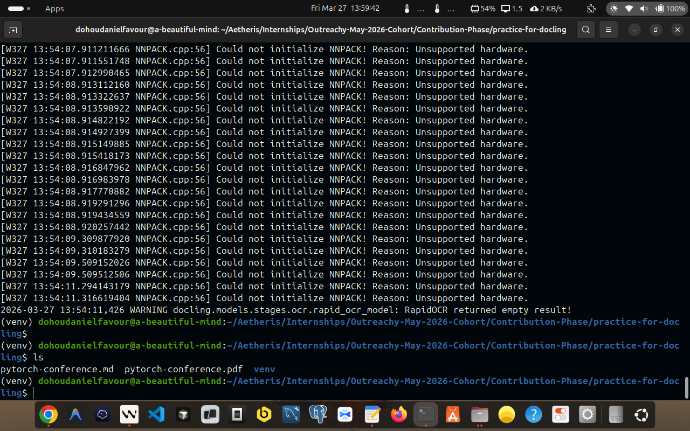
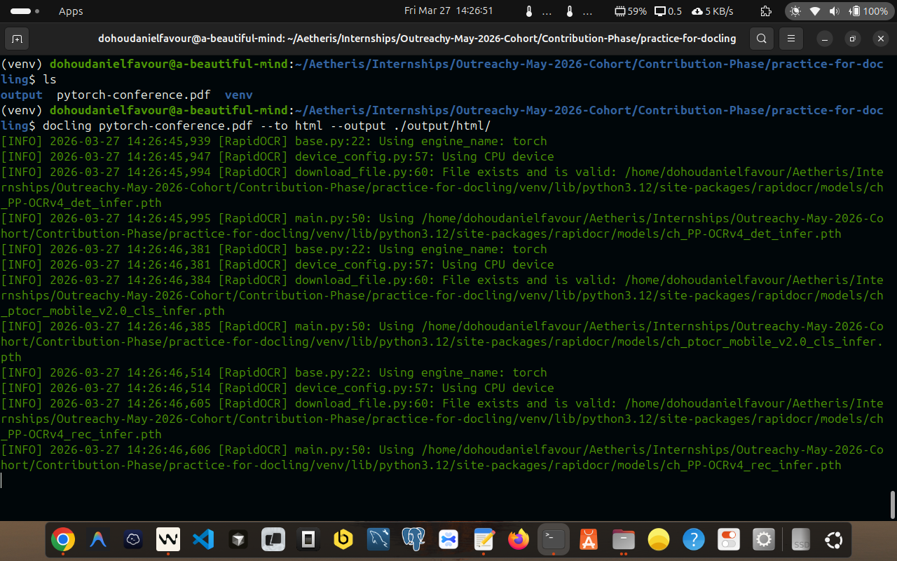
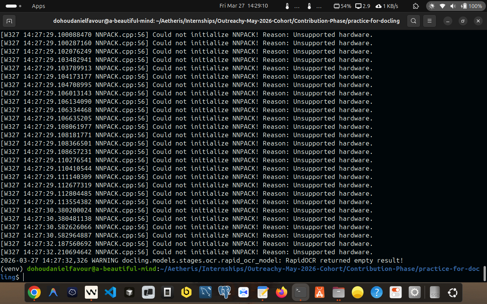
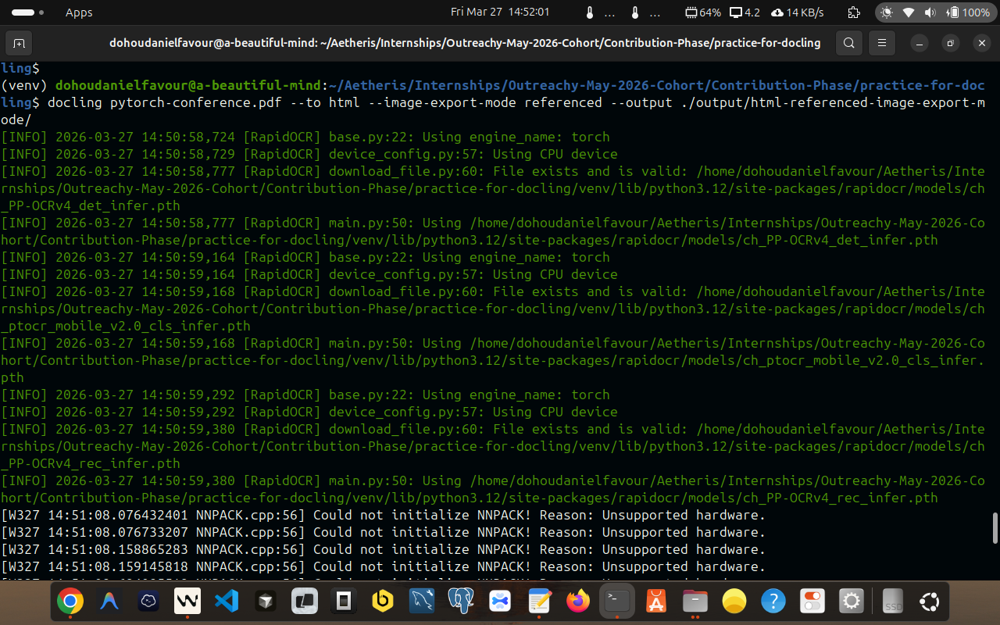
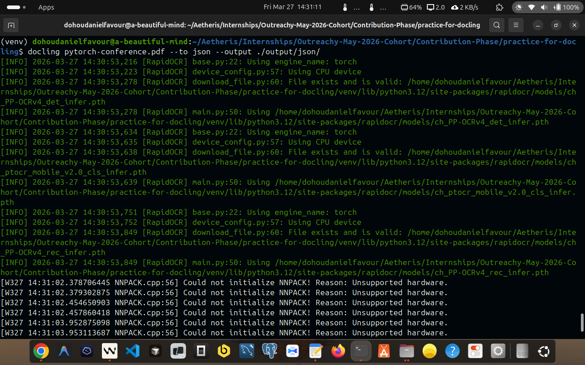
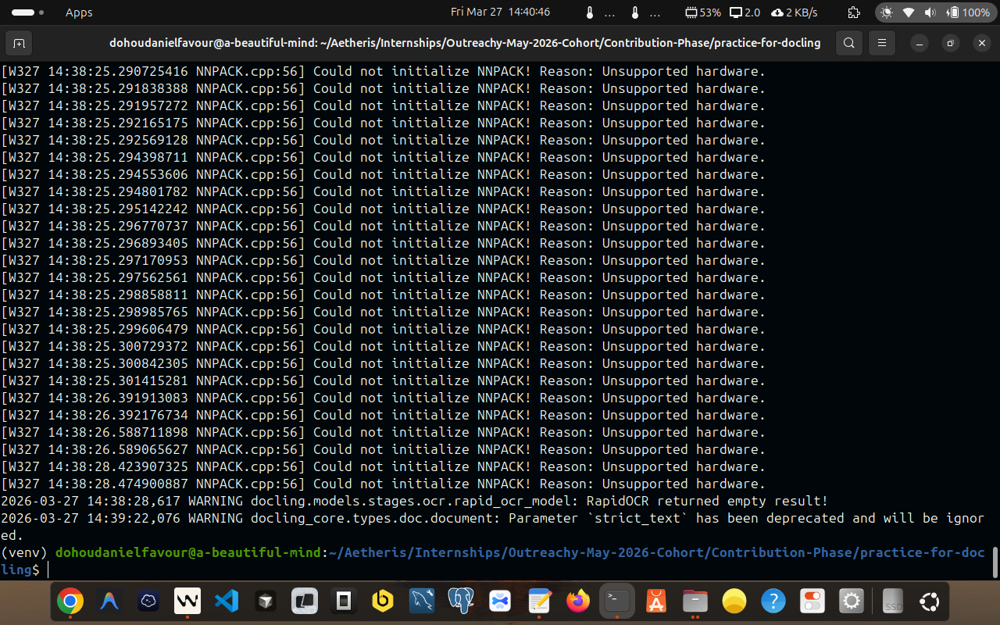

## Docling Exploration: My Outreachy 2026 Contribution
- **Issue:** [Issue #122: Docling: explore document processing basics](https://forge.fedoraproject.org/commops/interns/issues/122)
- **Author:** Dohou Daniel Favour
- **Date:** 2026-03-27
- **Task:** Docling - Document Processing Basics (Exploration)

---

### Background and Purpose

**[Docling](https://www.docling.ai/)** is the document processing layer that makes this possible. Before a language model can reason about a PDF, that PDF must be converted into clean, structured text. Docling does that conversion. It is not a simple text extractor: it is a document understanding system that uses machine learning models to identify layout regions, reconstruct table structure, determine reading order, and produce output optimised for downstream AI workflows.

This task establishes a working understanding of Docling's CLI, its output formats, its processing options, and the trade-offs between them: all of which are directly relevant to how Ramalama's RAG pipeline behaves in practice.

---

### Environment For This Task

| Component | Version |
|---|---|
| OS | Linux 6.14.0-37-generic (Ubuntu) x86\_64 |
| Python | CPython 3.12.3 |
| pip | 24.0 |
| docling | **2.82.0** |
| docling-core | 2.70.2 |
| docling-ibm-models | 3.12.0 |
| docling-parse | 5.6.1 |
| GPU | None (CPU-only inference) |

All commands were run inside a Python virtual environment (`venv`). The environment was activated with:

```bash
source venv/bin/activate
```

---

### Source Document

- **File:** `pytorch-conference.pdf`
- **Size:** 4.7 MB
- **Content:** PyTorch Conference 2026: Sponsorship Prospectus (Paris, France, 7–8 April 2026)

This document was chosen because it is an excellent stress-test for a document processing pipeline:

- **Multi-column layout**: pages use side-by-side column arrangements
- **Large sponsorship comparison table**: a 7-column, 20-row table listing benefits across Diamond, Gold, Silver, Bronze, Startup, and Non-Profit tiers with pricing from $4,000 to $50,000
- **Multiple embedded images**: logos, graphics, decorative elements (25 images total)
- **Mixed content**: text blocks, headings, lists, figures, and structured tables all on the same pages
- **Real-world document**: not a synthetic test; produced by a professional typesetter

A sponsorship brochure is more challenging than a plain text document and more representative of the kinds of documents a RAG system would need to process in production.


---

### About the Warnings

Every run produced these warnings:

```
[W327 13:54:08.913322637 NNPACK.cpp:56] Could not initialize NNPACK!
Reason: Unsupported hardware.
```

And occasionally:

```
WARNING docling.models.stages.ocr.rapid_ocr_model: RapidOCR returned empty result!
```

**These are not errors.** They do not affect output quality.

- **NNPACK warning**: NNPACK is an optional CPU acceleration library for PyTorch. This machine's CPU does not support the required instruction sets. PyTorch falls back to standard CPU operations automatically. This warning appears on every run and can safely be ignored.

- **RapidOCR empty result**: Docling's OCR engine (RapidOCR) tried to extract text from a region: likely a decorative image or logo: and found no readable text. This is expected behaviour for graphical elements that contain no text. The rest of the document is unaffected.

---

### Documentation Of All Steps I Carried Out To Complete This Task, Using Docling

#### Step 1: Installation of Docling

Docling was installed inside a Python virtual environment to keep dependencies isolated.


```bash
# Create and activate the virtual environment
python3 -m venv venv
source venv/bin/activate

# Install docling
pip install docling
```


Docling pulls in a substantial dependency tree including PyTorch, torchvision, and several IBM Research model packages. This is because Docling uses deep learning models for layout analysis and table structure recognition: it is not a lightweight text extractor.

To verify the installation:

```bash
pip show docling
```

Output:

```
Name: docling
Version: 2.82.0
Summary: SDK and CLI for parsing PDF, DOCX, HTML, and more, to a unified
         document representation for powering downstream workflows such as
         gen AI applications.
Author: 
        Author-email: Christoph Auer <cau@zurich.ibm.com>, Michele Dolfi <dol@zurich.ibm.com>, Maxim Lysak <mly@zurich.ibm.com>, Nikos Livathinos <nli@zurich.ibm.com>, Ahmed Nassar <ahn@zurich.ibm.com>, Panos Vagenas <pva@zurich.ibm.com>, Peter Staar <taa@zurich.ibm.com>
License: 
        Location: ./venv/lib/python3.12/site-packages
Requires: accelerate, beautifulsoup4, certifi, defusedxml, docling-core, docling-ibm-models, docling-parse, filetype, huggingface_hub, lxml, marko, openpyxl, pandas, pillow, pluggy, polyfactory, pydantic, pydantic-settings, pylatexenc, pypdfium2, python-docx, python-pptx, rapidocr, requests, rtree, scipy, torch, torchvision, tqdm, typer
```

---

#### Step 2: Display the Version

```bash
docling --version
```

Output:

```
Docling version: 2.82.0
Docling Core version: 2.70.2
Docling IBM Models version: 3.12.0
Docling Parse version: 5.6.1
Python: cpython-312 (3.12.3)
Platform: Linux-6.14.0-37-generic-x86_64-with-glibc2.39
```

`--version` reports not just the top-level `docling` package but all sub-packages in the Docling ecosystem:

- **docling**: the CLI and SDK entry point
- **docling-core**: the unified document model (`DoclingDocument`) and shared data structures
- **docling-ibm-models**: the ML models (layout analysis, table structure recognition)
- **docling-parse**: the PDF parsing backend


I also aim to get myself familiar with the `man page` of docling:


---

#### Step 3: Default Conversion (Markdown)

```bash
docling pytorch-conference.pdf
```

Since no `--output` was specified initially, the output was written to the current directory, then moved:

```bash
mv pytorch-conference.md output/default/
```

Or equivalently with `--output`:

```bash
docling pytorch-conference.pdf --output ./output/default/
```

- **Output:** `output/default/pytorch-conference.md`
- **File size:** 1.2 MB
- **Line count:** 281

#### Why Markdown is the Default for Docling Conversion

Markdown is the default output format because it serves RAG pipelines better than any other format at the intersection of three needs:

1. **LLM comprehension**: Language models trained on internet data have seen enormous amounts of Markdown and parse it natively. Headings, tables, and emphasis are meaningful to the model.
2. **Chunking structure**: RAG systems split documents into chunks before embedding. Markdown heading hierarchy (`#`, `##`, `###`) gives chunkers natural, semantically meaningful split points.
3. **Human verifiability**: A developer can open a `.md` file and immediately verify conversion quality. JSON or binary formats require additional tooling to inspect.
4. **Structured but not noisy**: HTML has hundreds of tags that are irrelevant to meaning. JSON has schema overhead. Plain text loses all structure. Markdown preserves headings, tables, lists, and emphasis with minimal syntax. An LLM trained on the internet has seen enormous amounts of Markdown and handles it natively.




---

#### Step 4: HTML Output

```bash
docling pytorch-conference.pdf --to html --output ./output/html/
```





- **Output:** `output/html/pytorch-conference.html`
- **File size:** 1.2 MB

#### What Changes

The PDF dociment is converted and is rendered to HTML:

- Section headers → `<h1>`, `<h2>`, `<h3>`
- Body text → `<p>`
- Tables → `<table>` with proper `<tr>`, `<th>`, `<td>` structure
- Images → `` (embedded by default)

The HTML file is **self-contained**: one file that renders completely in any browser with no external dependencies.

**File size comparison:**

| Format | Size | Notes |
|---|---|---|
| Markdown | 1.2 MB | 25 base64 images embedded |
| HTML (embedded) | 1.2 MB | Same image data, additional HTML tags |

Both files are approximately the same size because both embed the same 25 images as base64 data. The HTML tags add negligible overhead compared to the image data.

---

#### Step 4b: HTML with Referenced Images

```bash
docling pytorch-conference.pdf --to html --image-export-mode referenced \
  --output ./output/html-referenced-image-export-mode/
```

- **Output:** `output/html-referenced-image-export-mode/pytorch-conference.html` + 25 PNG files
- **HTML file size:** 22 KB
- **PNG artifacts total:** ~900 KB
- **Combined total:** ~922 KB



#### What Changes

With `--image-export-mode referenced`, Stage 8 performs two operations instead of one:

1. Each image is extracted from the `DoclingDocument`, rendered as a PNG file, and written to an `_artifacts/` subdirectory with a hash-based filename.
2. The HTML file references those PNG files with relative `` tags instead of embedding base64 data.

The HTML file shrinks from 1.2 MB to **22 KB**: a **~55x reduction** in the primary file size.

**Image export modes available:**

| Mode | HTML file | Image data location | Self-contained? |
|---|---|---|---|
| `embedded` (default) | ~1.2 MB | Inside the HTML as base64 | Yes |
| `referenced` | ~22 KB | Separate PNG files in `_artifacts/` | No |
| `placeholder` | Smallest | Not exported at all | N/A |

#### Why This Matters for RAG

In a RAG pipeline, you typically do not embed images into your text index. You either skip them or process them through a separate vision model. The `referenced` mode gives you that separation automatically:

- The HTML file contains clean text and structure: fast to parse and index
- The PNG files are available separately for a vision model to process if needed
- No base64 decoding overhead when reading the document programmatically

For Ramalama running on a personal laptop, processing a 22 KB HTML file is dramatically more efficient than loading a 1.2 MB file into a text processing pipeline.

**Trade-off:** The HTML file is no longer self-contained. Moving it without its PNG siblings breaks all images. This is acceptable in a pipeline context where file relationships are managed by the system.

---

#### Step 5a: JSON Output

```bash
docling pytorch-conference.pdf --to json --output ./output/json/
```

- **Output:** `output/json/pytorch-conference.json`
- **File size:** 6.5 MB




#### What JSON Contains

JSON export does not produce a rendered document. It serialises the internal `DoclingDocument` model directly to disk: the same structure Docling uses internally before producing any other format.

Every element carries its full metadata:

```json
{
  "schema_name": "DoclingDocument",
  "version": "...",
  "texts": [
    {
      "label": "section_header",
      "text": "About PyTorch Conference",
      "prov": [{ "page_no": 1, "bbox": { "l": 72.0, "t": 340.0, "r": 540.0, "b": 355.0 } }]
    }
  ],
  "tables": [
    {
      "data": {
        "grid": [
          [{ "text": "DIAMOND 4 AVAILABLE", "is_header": true, ... }]
        ]
      }
    }
  ]
}
```

**Preserved in JSON but absent in Markdown:**
- Exact bounding box of every element on every page
- Semantic label for every element (`section_header`, `text`, `caption`, `table`, `figure`, `footnote`)
- Page number for every element
- Full table cell grid with row/column indices and header flags
- Document hierarchy (which heading owns which paragraphs)
- Base64-embedded images (accounts for the large file size)

#### Why JSON is Largest

| Format | Size | Reason |
|---|---|---|
| Text | 26 KB | Pure text content, no images, no metadata |
| Markdown | 1.2 MB | Text + structure + 25 base64 images |
| HTML | 1.2 MB | Text + HTML tags + 25 base64 images |
| YAML | 6.4 MB | Full document model + all metadata + images |
| JSON | 6.5 MB | Full document model + all metadata + images |

JSON is largest because it contains everything: all the structural intelligence from the ML pipeline (bounding boxes, labels, confidence data) plus the image data.

#### When to Use JSON

JSON is the format for **programmatic RAG pipelines**. Frameworks like LangChain and LlamaIndex consume the JSON document model to:
- Filter elements by semantic label (e.g., extract only tables)
- Know exactly which page a chunk came from (for citations and references)
- Build intelligent chunking strategies based on heading hierarchy
- Process text and images through separate pipelines

---

#### Step 5b: Text Output

```bash
docling pytorch-conference.pdf --to text --output ./output/text/
```

- **Output:** `output/text/pytorch-conference.txt`
- **File size:** 26 KB



#### What Text Contains

Text output writes only the string content of each element in reading order, with no formatting markers:

```
7-8 April 2026 | Paris, France
2026 SPONSORSHIP PROSPECTUS
<!-- image -->
About PyTorch Conference
...
```

- Headings lose their `#` syntax: they are indistinguishable from body text
- Tables are **completely flattened**: cell structure is lost
- Images are replaced with `<!-- image -->` comments (not actual image data)
- File size drops to 26 KB because no image data is exported

From the docling CLI help: *"Text, DocTags, and WebVTT outputs do not export images."*

#### What Gets Lost

The sponsorship table: the most knowledge-dense part of this document: becomes unreadable in text format. The 7-column, 20-row structure that clearly maps benefits to sponsorship tiers collapses into a sequence of strings with no cell boundaries. An LLM reading this output cannot reliably answer "How many attendee passes does a Gold sponsor receive?" because the row-column relationship is gone.

#### When to Use Text

Text output is appropriate only for **simple prose documents** with no tables or complex layout: a policy document, a letter, a novel. For any document where tables carry knowledge, text output is the wrong choice for RAG.

---

#### Step 5c: YAML Output

```bash
docling pytorch-conference.pdf --to yaml --output ./output/yaml/
```

- **Output:** `output/yaml/pytorch-conference.yaml`
- **File size:** 6.4 MB


#### What YAML Contains

YAML export serialises the identical `DoclingDocument` as JSON export. The content is the same. Only the serialisation syntax differs: no curly braces, no quotes on keys, indentation-based structure:

```yaml
- label: section_header
  text: About PyTorch Conference
  prov:
    - page_no: 1
      bbox:
        l: 72.0
        t: 340.0
        r: 540.0
        b: 355.0
```

#### JSON vs YAML

| Dimension | JSON | YAML |
|---|---|---|
| Content | Identical | Identical |
| File size | 6.5 MB | 6.4 MB |
| Human readability | Moderate | Higher |
| Python stdlib support | `import json` | Requires `pyyaml` |
| Parsing edge cases | Minimal | Known issues (e.g. `no` → `False`) |
| Ecosystem fit | APIs, web services | Config files, CI/CD, ML tools |

For Ramalama's RAG pipeline in Python, **JSON is the practical choice**: no extra dependency, no edge-case parsing risks. YAML is preferable when a downstream tool in the pipeline expects YAML input natively.

---