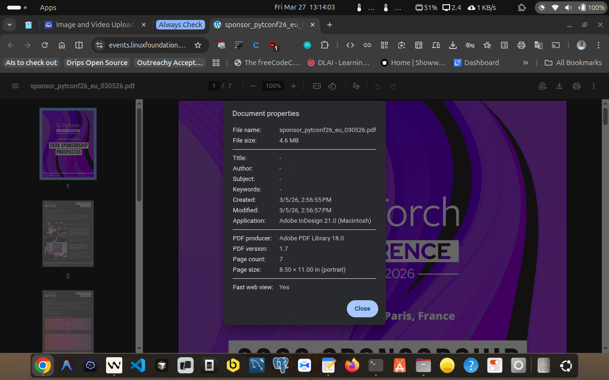
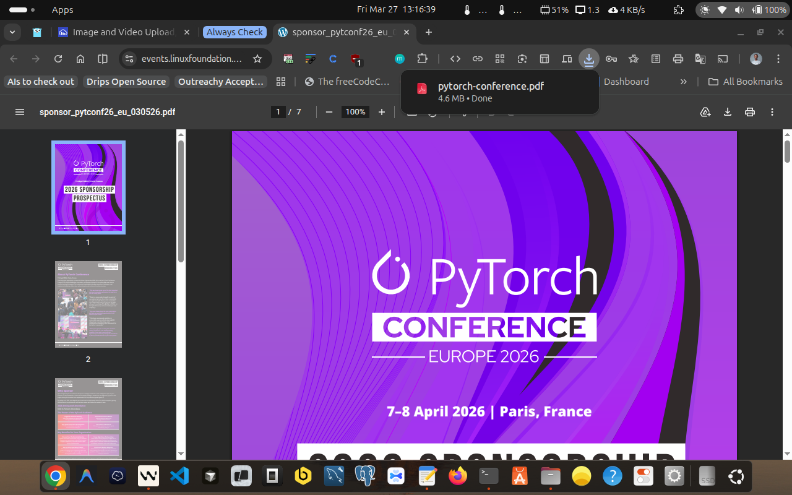
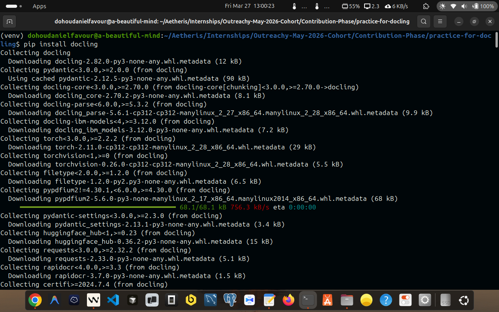
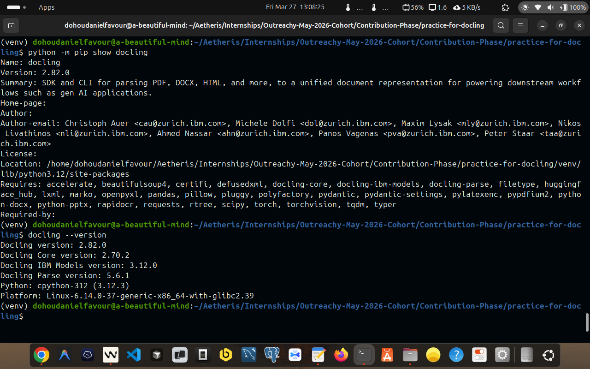
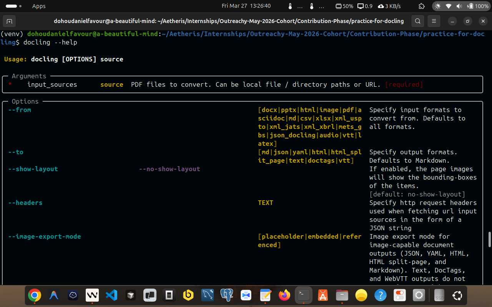
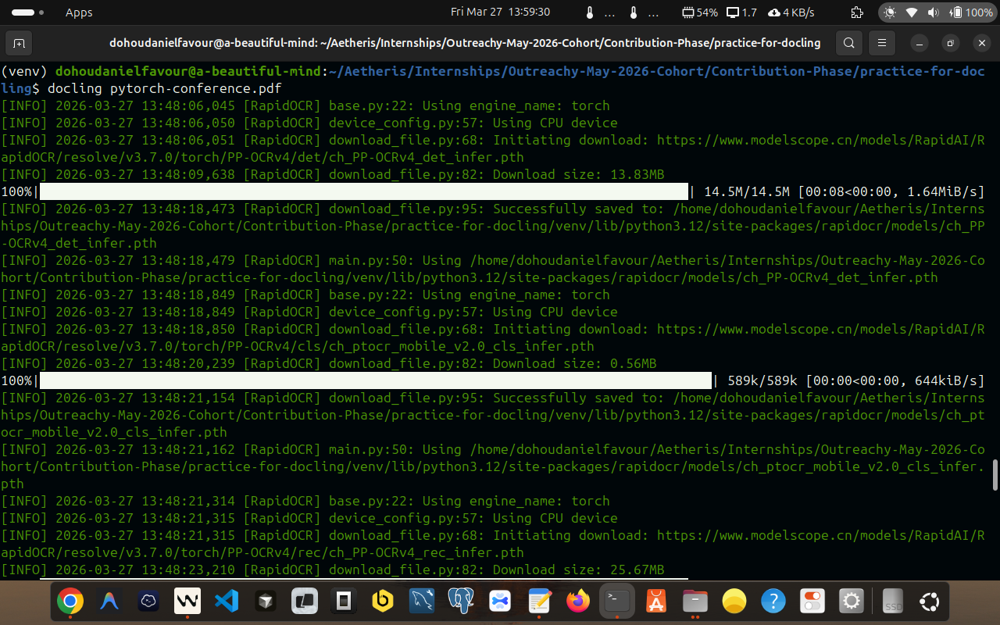

## Docling Exploration: My Outreachy 2026 Contribution
- **Issue:** [Issue #122: Docling: explore document processing basics](https://forge.fedoraproject.org/commops/interns/issues/122)
- **Author:** Dohou Daniel Favour
- **Date:** 2026-03-27
- **Task:** Docling - Document Processing Basics (Exploration)

---

### Background and Purpose

**[Docling](https://www.docling.ai/)** is the document processing layer that makes this possible. Before a language model can reason about a PDF, that PDF must be converted into clean, structured text. Docling does that conversion. It is not a simple text extractor: it is a document understanding system that uses machine learning models to identify layout regions, reconstruct table structure, determine reading order, and produce output optimised for downstream AI workflows.

This task establishes a working understanding of Docling's CLI, its output formats, its processing options, and the trade-offs between them: all of which are directly relevant to how Ramalama's RAG pipeline behaves in practice.

---

### Environment For This Task

| Component | Version |
|---|---|
| OS | Linux 6.14.0-37-generic (Ubuntu) x86\_64 |
| Python | CPython 3.12.3 |
| pip | 24.0 |
| docling | **2.82.0** |
| docling-core | 2.70.2 |
| docling-ibm-models | 3.12.0 |
| docling-parse | 5.6.1 |
| GPU | None (CPU-only inference) |

All commands were run inside a Python virtual environment (`venv`). The environment was activated with:

```bash
source venv/bin/activate
```

---

### Source Document

**File:** `pytorch-conference.pdf`
**Size:** 4.7 MB
**Content:** PyTorch Conference 2026: Sponsorship Prospectus (Paris, France, 7–8 April 2026)

This document was chosen because it is an excellent stress-test for a document processing pipeline:

- **Multi-column layout**: pages use side-by-side column arrangements
- **Large sponsorship comparison table**: a 7-column, 20-row table listing benefits across Diamond, Gold, Silver, Bronze, Startup, and Non-Profit tiers with pricing from $4,000 to $50,000
- **Multiple embedded images**: logos, graphics, decorative elements (25 images total)
- **Mixed content**: text blocks, headings, lists, figures, and structured tables all on the same pages
- **Real-world document**: not a synthetic test; produced by a professional typesetter

A sponsorship brochure is more challenging than a plain text document and more representative of the kinds of documents a RAG system would need to process in production.





---

### Documentation Of All Steps I Carried Out To Complete This Task, Using Docling

#### Step 1: Installation of Docling

Docling was installed inside a Python virtual environment to keep dependencies isolated.


```bash
# Create and activate the virtual environment
python3 -m venv venv
source venv/bin/activate

# Install docling
pip install docling
```



Docling pulls in a substantial dependency tree including PyTorch, torchvision, and several IBM Research model packages. This is because Docling uses deep learning models for layout analysis and table structure recognition: it is not a lightweight text extractor.

To verify the installation:

```bash
pip show docling
```

Output:

```
Name: docling
Version: 2.82.0
Summary: SDK and CLI for parsing PDF, DOCX, HTML, and more, to a unified
         document representation for powering downstream workflows such as
         gen AI applications.
Author: 
        Author-email: Christoph Auer <cau@zurich.ibm.com>, Michele Dolfi <dol@zurich.ibm.com>, Maxim Lysak <mly@zurich.ibm.com>, Nikos Livathinos <nli@zurich.ibm.com>, Ahmed Nassar <ahn@zurich.ibm.com>, Panos Vagenas <pva@zurich.ibm.com>, Peter Staar <taa@zurich.ibm.com>
License: 
        Location: ./venv/lib/python3.12/site-packages
Requires: accelerate, beautifulsoup4, certifi, defusedxml, docling-core, docling-ibm-models, docling-parse, filetype, huggingface_hub, lxml, marko, openpyxl, pandas, pillow, pluggy, polyfactory, pydantic, pydantic-settings, pylatexenc, pypdfium2, python-docx, python-pptx, rapidocr, requests, rtree, scipy, torch, torchvision, tqdm, typer
```

---

### Step 2: Display the Version

```bash
docling --version
```

Output:

```
Docling version: 2.82.0
Docling Core version: 2.70.2
Docling IBM Models version: 3.12.0
Docling Parse version: 5.6.1
Python: cpython-312 (3.12.3)
Platform: Linux-6.14.0-37-generic-x86_64-with-glibc2.39
```

`--version` reports not just the top-level `docling` package but all sub-packages in the Docling ecosystem:

- **docling**: the CLI and SDK entry point
- **docling-core**: the unified document model (`DoclingDocument`) and shared data structures
- **docling-ibm-models**: the ML models (layout analysis, table structure recognition)
- **docling-parse**: the PDF parsing backend




I also aim to get myself familiar with the `man page` of docling:



---

### Step 3: Default Conversion (Markdown)

```bash
docling pytorch-conference.pdf
```

Since no `--output` was specified initially, the output was written to the current directory, then moved:

```bash
mv pytorch-conference.md output/default/
```

Or equivalently with `--output`:

```bash
docling pytorch-conference.pdf --output ./output/default/
```

**Output:** `output/default/pytorch-conference.md`
**File size:** 1.2 MB
**Line count:** 281

### Why Markdown is the Default

Markdown is the default output format because it serves RAG pipelines better than any other format at the intersection of three needs:

1. **LLM comprehension**: Language models trained on internet data have seen enormous amounts of Markdown and parse it natively. Headings, tables, and emphasis are meaningful to the model.
2. **Chunking structure**: RAG systems split documents into chunks before embedding. Markdown heading hierarchy (`#`, `##`, `###`) gives chunkers natural, semantically meaningful split points.
3. **Human verifiability**: A developer can open a `.md` file and immediately verify conversion quality. JSON or binary formats require additional tooling to inspect.
4. **Structured but not noisy**: HTML has hundreds of tags that are irrelevant to meaning. JSON has schema overhead. Plain text loses all structure. Markdown preserves headings, tables, lists, and emphasis with minimal syntax. An LLM trained on the internet has seen enormous amounts of Markdown and handles it natively.



---

### About the Warnings

Every run produced these warnings:

```
[W327 13:54:08.913322637 NNPACK.cpp:56] Could not initialize NNPACK!
Reason: Unsupported hardware.
```

And occasionally:

```
WARNING docling.models.stages.ocr.rapid_ocr_model: RapidOCR returned empty result!
```

**These are not errors.** They do not affect output quality.

- **NNPACK warning**: NNPACK is an optional CPU acceleration library for PyTorch. This machine's CPU does not support the required instruction sets. PyTorch falls back to standard CPU operations automatically. This warning appears on every run and can safely be ignored.

- **RapidOCR empty result**: Docling's OCR engine (RapidOCR) tried to extract text from a region: likely a decorative image or logo: and found no readable text. This is expected behaviour for graphical elements that contain no text. The rest of the document is unaffected.

---